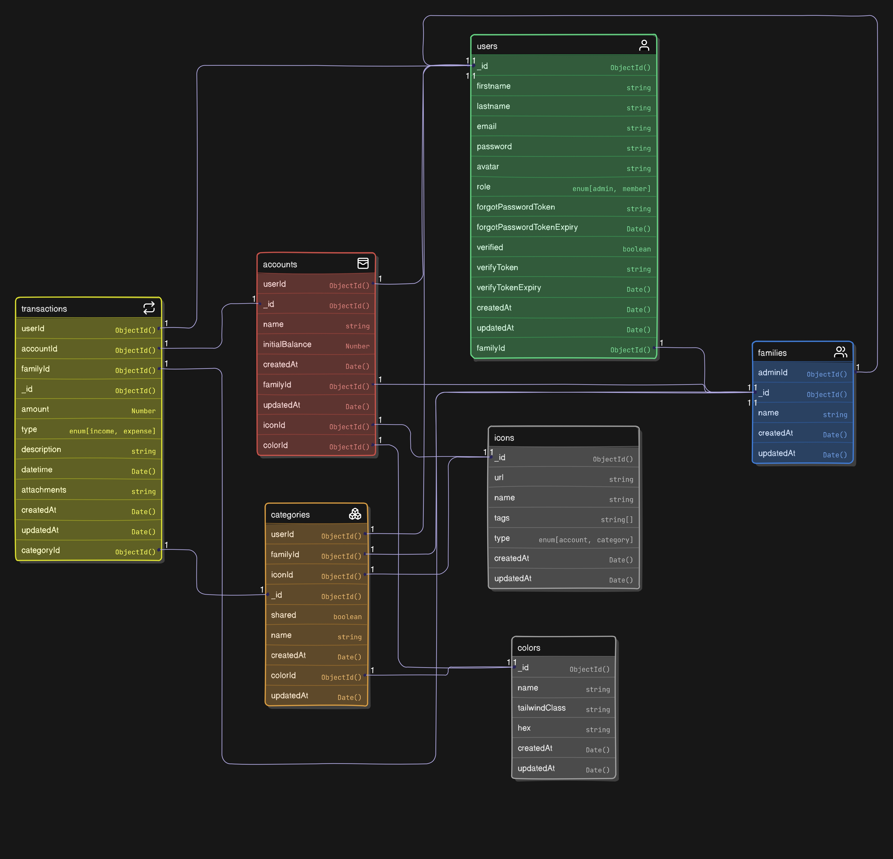

# WalletLink - Family Financial Management System

WalletLink is a comprehensive family financial management platform that enables families to track expenses, manage accounts, and monitor transactions collaboratively. Built with modern web technologies, it provides a secure and intuitive interface for financial planning and tracking.

## Description

WalletLink simplifies family financial management by providing a centralized platform where family members can:

- Track income and expenses across multiple accounts
- Categorize transactions with custom icons and colors
- Generate insightful financial reports and charts
- Manage family member access with role-based permissions
- View detailed transaction histories and account balances
- Set up and manage multiple financial accounts (bank, cash, digital wallets, etc.)

## Features

### 🔐 Authentication & User Management

- Secure user registration and login
- JWT-based authentication with cookies
- Password reset functionality via email
- Family-based user grouping with admin/member roles
- Member invitation system via email links

### 💰 Financial Account Management

- Create and manage multiple accounts (Bank, Cash, Credit Card, Digital Wallets)
- Customizable account icons and colors
- Real-time balance tracking with income/expense calculations
- Account-specific transaction history
- Visual account overview with balance trends

### 📊 Transaction Management

- Add, edit, and delete transactions
- Categorize transactions with custom categories
- Support for both income and expense transactions
- Attach descriptions and timestamps
- Filter transactions by account, member, or date range
- Detailed transaction view with all metadata

### 👨‍👩‍👧‍👦 Family Management

- Admin can invite family members via email
- Role-based access control (Admin/Member)
- Member profile management
- Family-wide financial overview
- Individual member transaction tracking

### 📈 Dashboard & Analytics

- Comprehensive dashboard with financial overview
- Monthly income vs expense charts
- Category-wise expense breakdown (pie charts)
- Recent transaction feeds
- Account balance summaries
- Member-wise financial statistics

### 🎨 Customization

- Customizable category icons and colors
- Pre-seeded icons for common categories
- Color-coded accounts and categories
- Responsive design for all devices

## Tech Stack

### Frontend

- **React 19** - Modern UI library
- **TypeScript** - Type-safe development
- **Vite** - Fast build tool and dev server
- **Tailwind CSS 4** - Utility-first CSS framework
- **shadcn/ui** - Beautiful UI components
- **Radix UI** - Unstyled, accessible components
- **Redux Toolkit** - State management
- **React Router Dom** - Client-side routing
- **React Hook Form** - Form handling
- **Recharts** - Data visualization
- **Axios** - HTTP client
- **React Hot Toast** - Notifications
- **Lucide React** - Icon library
- **Date-fns** - Date manipulation

### Backend

- **Node.js** - JavaScript runtime
- **Express.js** - Web application framework
- **MongoDB** - NoSQL database
- **Mongoose** - MongoDB object modeling
- **JWT** - JSON Web Tokens for authentication
- **bcrypt** - Password hashing
- **Nodemailer** - Email sending
- **Cloudinary** - Image upload and management
- **Multer** - File upload handling
- **Yup** - Schema validation
- **Morgan** - HTTP request logger
- **CORS** - Cross-origin resource sharing

### Database

- **MongoDB** - Document-based NoSQL database with collections for:
  - Users (family members)
  - Families (family groups)
  - Accounts (financial accounts)
  - Transactions (financial records)
  - Categories (transaction categories)
  - Icons (UI icons)
  - Colors (UI colors)

## Getting Started

### Prerequisites

- **Node.js** (version 18 or higher)
- **MongoDB** (local installation or MongoDB Atlas)
- **npm** or **yarn** package manager

### Installation

1. **Clone the repository**

   ```bash
   git clone <repository-url>
   cd WalletLink
   ```

2. **Install server dependencies**

   ```bash
   cd server
   npm install
   ```

3. **Install client dependencies**

   ```bash
   cd ../client
   npm install
   ```

4. **Set up environment variables**

   Create `.env` file in the `server` directory:

   ```bash
   cd ../server
   cp .env.example .env
   ```

   Edit the `.env` file with your configuration:

   ```env
   PORT=8000
   MONGODB_URL="mongodb://localhost:27017"
   NODE_ENV="development"
   CORS_ORIGIN="http://localhost:5173"
   JWT_SECRET="your-super-secret-jwt-key"
   JWT_EXPIRY="10d"
   DOMAIN="http://localhost:5173"

   # Cloudinary (for image uploads)
   CLOUDINARY_CLOUD_NAME=your-cloudinary-name
   CLOUDINARY_API_KEY=your-api-key
   CLOUDINARY_API_SECRET=your-api-secret

   # Email configuration (for invitations and password reset)
   EMAIL_USER=your-email@example.com
   EMAIL_PASS=your-email-password
   ```

5. **Seed the database**
   ```bash
   # Seed icons and colors
   npm run seed:icons
   npm run seed:colors
   ```

### Running the App

1. **Start the backend server**

   ```bash
   cd server
   npm run dev
   ```

   Server will run on `http://localhost:8000`

2. **Start the frontend client** (in a new terminal)

   ```bash
   cd client
   npm run dev
   ```

   Client will run on `http://localhost:5173`

3. **Access the application**
   - Open your browser and navigate to `http://localhost:5173`
   - Register a new account to get started
   - The first user automatically becomes the family admin

## Folder Structure

```
WalletLink/
├── client/                 # React frontend application
│   ├── public/            # Static assets
│   ├── src/
│   │   ├── api/           # API service functions
│   │   ├── components/    # Reusable UI components
│   │   ├── lib/           # Utility libraries
│   │   ├── pages/         # Application pages/routes
│   │   ├── store/         # Redux store configuration
│   │   └── types/         # TypeScript type definitions
│   ├── package.json
│   └── vite.config.ts
├── server/                # Node.js backend application
│   ├── src/
│   │   ├── controllers/   # Route handlers
│   │   ├── models/        # Database models
│   │   ├── routes/        # API routes
│   │   ├── middlewares/   # Custom middleware
│   │   ├── utils/         # Utility functions
│   │   ├── validators/    # Input validation schemas
│   │   ├── seeds/         # Database seeding scripts
│   │   └── DB/            # Database connection
│   ├── package.json
│   └── .env.example
└── postman/               # API testing collections
```

## Database Schema



### Collections Overview

- **Users**: Family members with authentication and role information
- **Families**: Family groups linking users together
- **Accounts**: Financial accounts (bank, cash, etc.) with balance tracking
- **Transactions**: Income/expense records with category and account references
- **Categories**: Transaction categories with customizable icons and colors
- **Icons**: Available icons for accounts and categories
- **Colors**: Available colors for visual customization

## Environment Variables

### Server (.env)

```env
# Server Configuration
PORT=8000
NODE_ENV=development
CORS_ORIGIN=http://localhost:5173
DOMAIN=http://localhost:5173

# Database
MONGODB_URL=mongodb://localhost:27017

# Authentication
JWT_SECRET=your-super-secret-jwt-key
JWT_EXPIRY=10d

# File Upload (Cloudinary)
CLOUDINARY_CLOUD_NAME=your-cloudinary-name
CLOUDINARY_API_KEY=your-api-key
CLOUDINARY_API_SECRET=your-api-secret

# Email Service
EMAIL_USER=your-email@example.com
EMAIL_PASS=your-email-password
```

## API Endpoints

### Authentication

- `POST /api/v1/users/register` - Register new user
- `POST /api/v1/users/login` - User login
- `POST /api/v1/users/logout` - User logout
- `GET /api/v1/users/me` - Get current user
- `POST /api/v1/users/forgot-password` - Request password reset
- `POST /api/v1/users/reset-password/:token` - Reset password
- `POST /api/v1/users/change-password` - Change password
- `POST /api/v1/users/update` - Update user profile
- `POST /api/v1/users/avatar` - Upload avatar

### Accounts

- `GET /api/v1/accounts` - Get all accounts
- `POST /api/v1/accounts` - Create new account
- `GET /api/v1/accounts/:id` - Get account by ID
- `POST /api/v1/accounts/:id` - Update account
- `DELETE /api/v1/accounts/:id` - Delete account

### Transactions

- `GET /api/v1/transactions` - Get all transactions
- `POST /api/v1/transactions` - Create new transaction
- `GET /api/v1/transactions/:id` - Get transaction by ID
- `POST /api/v1/transactions/:id` - Update transaction
- `DELETE /api/v1/transactions/:id` - Delete transaction

### Categories

- `GET /api/v1/categories` - Get all categories
- `POST /api/v1/categories` - Create new category
- `POST /api/v1/categories/:id` - Update category
- `DELETE /api/v1/categories/:id` - Delete category

### Family Members

- `GET /api/v1/members` - Get family members
- `POST /api/v1/members` - Invite new member
- `POST /api/v1/members/invite` - Accept invitation
- `GET /api/v1/members/:id` - Get member by ID
- `POST /api/v1/members/:id` - Update member
- `DELETE /api/v1/members/:id` - Remove member

### Dashboard

- `GET /api/v1/dashboard/account` - Get dashboard accounts
- `GET /api/v1/dashboard/members` - Get members summary
- `GET /api/v1/dashboard/transactions` - Get recent transactions
- `GET /api/v1/dashboard/monthly-income-expense` - Get monthly chart data
- `GET /api/v1/dashboard/category-breakdown` - Get category breakdown

### Resources

- `GET /api/v1/colors` - Get available colors
- `GET /api/v1/icons` - Get available icons

## Contributing

1. Fork the repository
2. Create your feature branch (`git checkout -b feature/amazing-feature`)
3. Commit your changes (`git commit -m 'Add some amazing feature'`)
4. Push to the branch (`git push origin feature/amazing-feature`)
5. Open a Pull Request

### Development Guidelines

- Follow TypeScript best practices
- Use ESLint and Prettier for code formatting
- Write descriptive commit messages
- Add proper error handling
- Include input validation
- Test API endpoints before submitting

## License

This project is licensed under the MIT License - see the [LICENSE](LICENSE) file for details.

---

**WalletLink** - Simplifying family financial management, one transaction at a time. 💰👨‍👩‍👧‍👦
